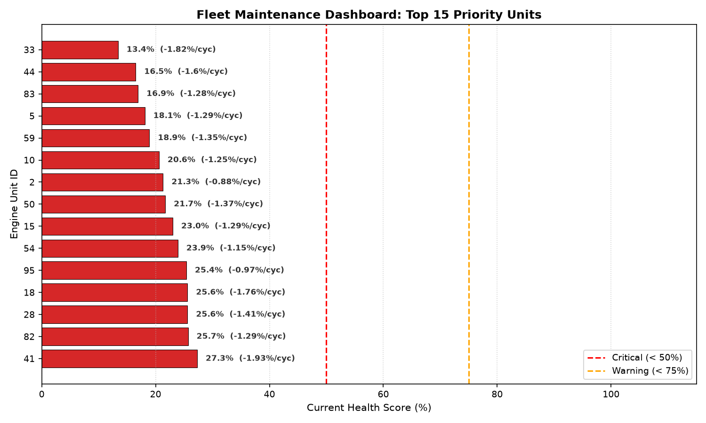
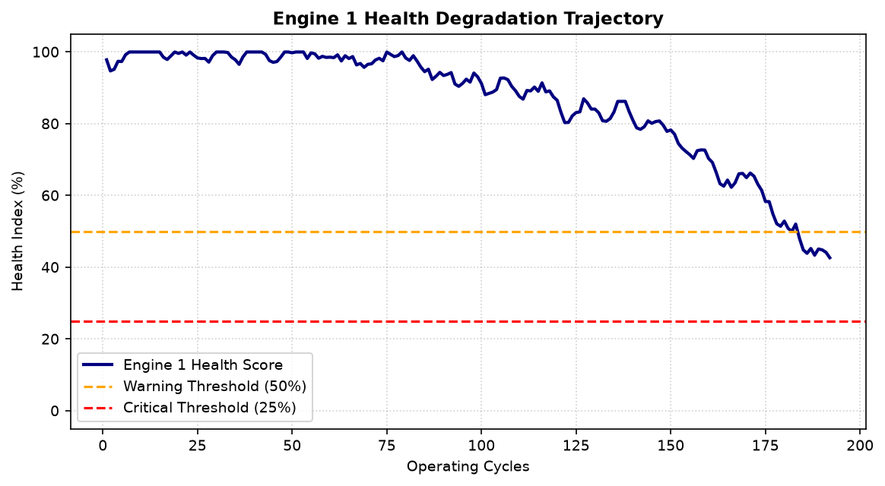

# Turbofan Fleet Condition Monitoring & Maintenance Triage

A condition-monitoring pipeline built on NASA's C-MAPSS (FD001) turbofan degradation dataset. It scores each engine's health from sensor drift against its own healthy baseline, and produces a ranked maintenance priority list across a 100-engine fleet.

**This is a rule-based scoring system, not a predictive model.**

No model was trained and no remaining-useful-life or failure-time forecast is made. The goal was an interpretable, explainable triage signal a maintenance team could trust and act on immediately, not maximum predictive accuracy.

---

## Dashboard & Visualizations

### Fleet Maintenance Priority — At-Risk Units
Engines ranked by current health score and recent decline rate:

### Single Engine Lifecycle — Unit 1
Health trajectory from healthy baseline through warning and critical thresholds:

---

## Approach

### 1. Sensor selection
The raw dataset has 21 sensor channels. Sensors with zero variance across the dataset (`sensor1`, `sensor5` `sensor10`, `sensor16`, `sensor18`, `sensor19`) carry no signal under this dataset's fixed operating condition and were dropped.

Four sensors were kept because they show a consistent, steady drift as engines degrade, and because that drift has a clear physical cause:

- **T24** (sensor2) — Low-Pressure Compressor outlet temperature
- **T30** (sensor3) — High-Pressure Compressor outlet temperature
- **T50** (sensor4) — Low-Pressure Turbine outlet temperature
- **Ps30** (sensor11) — Static pressure at HPC outlet

As a compressor or turbine wears, these are the readings that shift first; rising outlet temperatures and pressure changes are the textbook signature of declining component efficiency.

### 2. Baseline and drift score
Each engine's first 20 cycles define its own healthy baseline (mean and standard deviation per sensor). Every later reading is converted to a z-score against that baseline, the four sensors' z-scores are averaged into one composite drift value, and a 5-cycle rolling average smooths out cycle-to-cycle noise.

### 3. Health score
Health Score = clip(100 − (composite_drift × 10), 0, 100)

- ~100% — at or near baseline, healthy
- 50% — warning threshold, schedule maintenance
- 25% — critical threshold, service now

The scaling and thresholds are heuristic choices, tuned by inspecting the score's behavior against known engine lifespans in the dataset — not derived from a physical model.

### 4. Fleet triage
All 100 engines are ranked by two numbers: current health score, and the rate of health lost over the last 15 cycles. Ranking on both, rather than health alone, separates engines in steady gradual decline from engines dropping fast — the second group is the more urgent one even at the same current score.

---

## Output
- `fleet_maintenance_priority.csv` — full fleet, ranked by urgency
- `fleet_maintenance_dashboard.png` — top 15 engines needing service
- `engine_1_validation.png` — single-engine degradation trajectory

## Stack
Python, pandas, numpy, matplotlib

## Data
NASA C-MAPSS Turbofan Engine Degradation Simulation, FD001 subset.
https://www.nasa.gov/intelligent-systems-division/discovery-and-systems-health/pcoe/pcoe-data-set-repository/

## Possible extensions
- Validate score thresholds against the dataset's true failure cycles
- Compare this rule-based ranking against a trained RUL model as a baseline
- Extend to the multi-condition subsets (FD002/FD004)
